# KỊCH BẢN THUYET TRÌNH 20 PHÚT: DỰ ÁN MARXMIND
**Đề tài: Tồn tại xã hội quyết định ý thức xã hội (Triết học Marx - Lenin)**

Dưới đây là cấu trúc phân chia phần thuyết trình tối ưu cho nhóm **5 thành viên**, đảm bảo thời lượng **20 phút** (trung bình 4 phút/người) bám sát các tương tác trực quan trên Website.

---

## TỔNG QUAN PHÂN CHIA THỜI GIAN (20 PHÚT)

```mermaid
gantt
    title Phân chia thời lượng thuyết trình 20 phút
    dateFormat  m
    axisFormat %M phút
    
    section Thành viên 1
    Đặt vấn đề & Mở đầu (Màn 1)          :active, 0, 4m
    section Thành viên 2
    Tồn tại vật chất & Tầng lớp (Màn 2, 3): 4, 8m
    section Thành viên 3
    Lịch sử & Thực tại số hóa (Màn 4, 5)  : 8, 12m
    section Thành viên 4
    Khảo sát & Tương tác (Quiz + Lắc)     : 12, 16m
    section Thành viên 5
    Tổng kết & Phân tích Marxist (Kết quả): 16, 20m
```

---

## CHI TIẾT KỊCH BẢN & PHẦN NÓI CỦA TỪNG THÀNH VIÊN

### 👤 THÀNH VIÊN 1: NGƯỜI DẪN CHUYỆN (PHÚT 0:00 - 4:00)
* **Nhiệm vụ**: Điều phối chung, mở màn slide đầu tiên và giới thiệu bài học.
* **Giao diện Web tương ứng**: Slide mở đầu (Lời mở đầu - *Bạn có thực sự tự do đưa ra quyết định?*).
* **Nội dung nói chính**:
  1. **Chào hỏi & Đặt câu hỏi kích thích**: *"Mỗi sáng thức dậy, chúng ta tin rằng mình tự do lựa chọn ly cà phê, chọn quần áo, hay chọn ước mơ lớn. Nhưng liệu ta có thực sự tự do, hay mọi quyết định đều đang bị thao túng bởi hoàn cảnh vật chất bên ngoài?"*
  2. **Dẫn nhập Lý thuyết**: Giới thiệu định lý kinh điển của Karl Marx: **Tồn tại xã hội quyết định ý thức xã hội**.
  3. **Giới thiệu công cụ**: Nhóm đã xây dựng nền tảng tương tác **MarxMind** để đưa người nghe vào một cuộc hành trình nhập vai điện ảnh, chứng minh quy luật này qua đời thực.

---

### 👤 THÀNH VIÊN 2: NHÀ PHÂN TÍCH HẠ TẦNG VÀ TẦNG LỚP (PHÚT 4:00 - 8:00)
* **Nhiệm vụ**: Trình bày về nguồn gốc vật chất và sự phân hóa ý thức theo vị thế kinh tế.
* **Giao diện Web tương ứng**: Stage I (*Cái nôi định hình sự sống*) và Stage II (*Những lăng kính khác biệt*).
* **Nội dung nói chính**:
  1. **Nền tảng sinh tồn (Stage I)**: Trước khi làm thơ, vẽ tranh hay nghiên cứu triết học, con người phải ăn, uống, mặc và tìm chỗ trú ẩn. Phương thức sản xuất vật chất này là cái nôi đầu tiên quyết định nhận thức xã hội.
  2. **Sự chia rẽ nhận thức do giai cấp (Stage II)**: 
     - Chứng minh qua sự tương phản giữa **Sinh viên nghèo / Người lao động** (phải lo lắng cơm áo gạo tiền từng bữa, ưu tiên sự ổn định) và **CEO / Người giàu** (có bệ đỡ tài chính vững chắc, sẵn sàng mạo hiểm, tin vào chủ nghĩa cá nhân tự do).
     - Kết luận: *"Không phải ý thức của con người quyết định tồn tại của họ; trái lại, tồn tại xã hội của họ quyết định ý thức của họ."*

---

### 👤 THÀNH VIÊN 3: NHÀ ĐẤT NƯỚC HỌC & THỜI ĐẠI SỐ (PHÚT 8:00 - 12:00)
* **Nhiệm vụ**: Trình bày khía cạnh lịch sử biện chứng và sự dịch chuyển sang thời đại công nghệ số.
* **Giao diện Web tương ứng**: Stage III (*Dòng chảy thời đại*) và Stage IV (*Thực tại số hóa 4.0*).
* **Nội dung nói chính**:
  1. **Biện chứng lịch sử (Stage III)**: Ý thức tập thể thay đổi theo thời kỳ. Thời chiến tranh gian khổ tôi luyện tinh thần hy sinh đồng đội; thời bao cấp đề cao tính chia sẻ cộng đồng; thời nay đề cao cá nhân hóa. Tất cả do hạ tầng kinh tế - chính trị thay đổi.
  2. **Tồn tại xã hội kiểu mới - Thuật toán 4.0 (Stage IV)**:
     - Phân tích việc điện thoại di động và các thuật toán MXH (TikTok, Facebook) trở thành một phần của "tồn tại xã hội" hiện đại.
     - Thuật toán định hình luồng thông tin, từ đó định hình cảm xúc lo âu, chứng FOMO và cả thế giới quan của thế hệ trẻ. Ý thức của chúng ta đang bị lập trình gián tiếp bởi hạ tầng công nghệ.

---

### 👤 THÀNH VIÊN 4: ĐIỀU PHỐI VIÊN TƯƠNG TÁC (PHÚT 12:00 - 16:00)
* **Nhiệm vụ**: Hướng dẫn cả lớp/giám khảo tương tác trực tiếp với Slide Trắc nghiệm và thực hiện động tác Lắc điện thoại.
* **Giao diện Web tương ứng**: Trang Quiz (Stage 5) và Trang Shake (Stage 6).
* **Nội dung nói chính**:
  1. **Tổ chức Khảo sát nhanh**: Show câu hỏi số 1: *"Giữa giàu cô đơn và nghèo hạnh phúc, bạn chọn gì?"* Nhờ 1-2 bạn dưới lớp trả lời để chọn đáp án tương ứng trên Web.
  2. **Trải nghiệm Lắc thiết bị (Biện chứng quy luật)**:
     - Giải thích ý nghĩa của động tác lắc điện thoại: Đó là biểu trưng cho **sự tương tác và biến đổi thực tiễn**. Ý thức không tự nhiên sinh ra, nó cần sự va đập, tác động của hành động thực tế.
     - Bấm nút kích hoạt giả lập hoặc lắc điện thoại trực tiếp để chuyển trang kết quả.

---

### 👤 THÀNH VIÊN 5: NHÀ TRIẾT HỌC TỔNG KẾT (PHÚT 16:00 - 20:00)
* **Nhiệm vụ**: Đọc kết quả phân tích hệ tư tưởng, trích dẫn triết học biện chứng và đúc kết ý nghĩa thực tiễn của đề tài.
* **Giao diện Web tương ứng**: Trang kết quả (Stage 7).
* **Nội dung nói chính**:
  1. **Giải nghĩa Phổ ý thức (Spectrum Bar)**:
     - Giải thích mối tương quan giữa phần trăm **Vật chất** và **Tinh thần** của người dùng.
     - Nhấn mạnh: Duy vật biện chứng không phủ nhận tinh thần, mà khẳng định vật chất quyết định trước, nhưng tinh thần có tác động ngược trở lại cải tạo thế giới vật chất.
  2. **Bài học thực tiễn & Thông điệp kết luận**:
     - Muốn thay đổi tư duy hay cải tạo tệ nạn xã hội của một nhóm người, không thể chỉ nói đạo lý (ý thức), mà bắt buộc phải cải thiện điều kiện sống, công ăn việc làm và giáo dục (tồn tại vật chất) cho họ.
     - Kết thúc thuyết trình, cảm ơn và mở phần Q&A.

---

## 💡 MẸO ĐỂ ĐẠT ĐIỂM TUYỆT ĐỐI (A+)
* **Chuẩn bị thiết bị**: Thành viên 4 có thể dùng điện thoại kết nối quét mã QR để chiếu màn hình điện thoại lên máy chiếu. Khi thực hiện lắc điện thoại, cả lớp nhìn thấy màn hình rung chuyển động và chuyển trang kết quả sẽ tạo hiệu ứng thị giác cực kỳ chuyên nghiệp (Cinematic Immersive).
* **Phân phối nhịp nhàng**: Chuyển phần giữa các thành viên bằng các câu nối tự nhiên liên quan đến logic website (ví dụ: *"Khi hạ tầng vật chất đã định hình như bạn Thành trình bày, vậy dòng chảy thời gian thay đổi nó ra sao? Xin mời bạn tiếp theo..."*).
